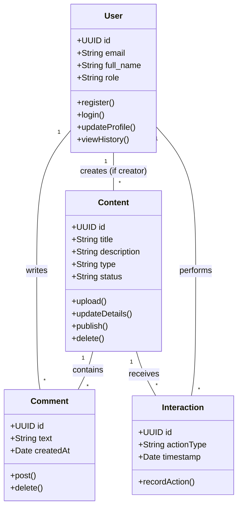

```mermaid
classDiagram
    class User {
        +UUID id
        +String email
        +String full_name
        +String role
        +register()
        +login()
        +updateProfile()
        +viewHistory()
    }

    class Content {
        +UUID id
        +String title
        +String description
        +String type
        +String status
        +upload()
        +updateDetails()
        +publish()
        +delete()
    }

    class Comment {
        +UUID id
        +String text
        +Date createdAt
        +post()
        +delete()
    }

    class Interaction {
        +UUID id
        +String actionType
        +Date timestamp
        +recordAction()
    }

    User "1" -- "*" Comment : writes
    User "1" -- "*" Content : creates (if creator)
    User "1" -- "*" Interaction : performs
    Content "1" -- "*" Comment : contains
    Content "1" -- "*" Interaction : receives
```
