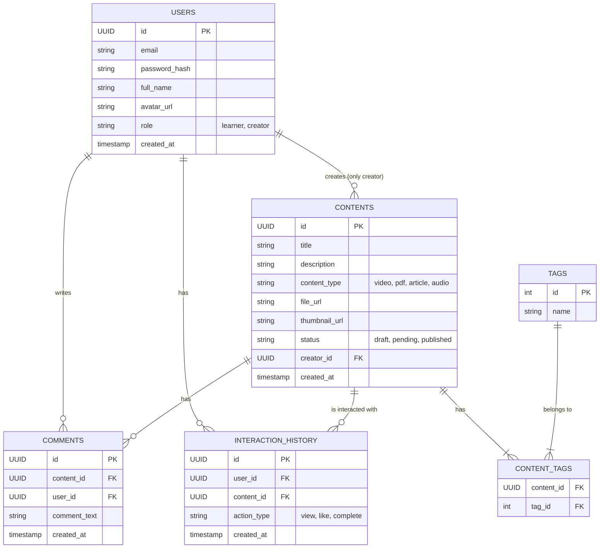

```mermaid
erDiagram
    USERS {
        UUID id PK
        string email
        string password_hash
        string full_name
        string avatar_url
        string role "learner, creator"
        timestamp created_at
    }
    
    CONTENTS {
        UUID id PK
        string title
        string description
        string content_type "video, pdf, article, audio"
        string file_url
        string thumbnail_url
        string status "draft, pending, published"
        UUID creator_id FK
        timestamp created_at
    }

    TAGS {
        int id PK
        string name
    }

    CONTENT_TAGS {
        UUID content_id FK
        int tag_id FK
    }

    COMMENTS {
        UUID id PK
        UUID content_id FK
        UUID user_id FK
        string comment_text
        timestamp created_at
    }

    INTERACTION_HISTORY {
        UUID id PK
        UUID user_id FK
        UUID content_id FK
        string action_type "view, like, complete"
        timestamp created_at
    }

    USERS ||--o{ CONTENTS : "creates (only creator)"
    USERS ||--o{ COMMENTS : "writes"
    USERS ||--o{ INTERACTION_HISTORY : "has"
    CONTENTS ||--o{ COMMENTS : "has"
    CONTENTS ||--o{ INTERACTION_HISTORY : "is interacted with"
    CONTENTS ||--|{ CONTENT_TAGS : "has"
    TAGS ||--|{ CONTENT_TAGS : "belongs to"
```
